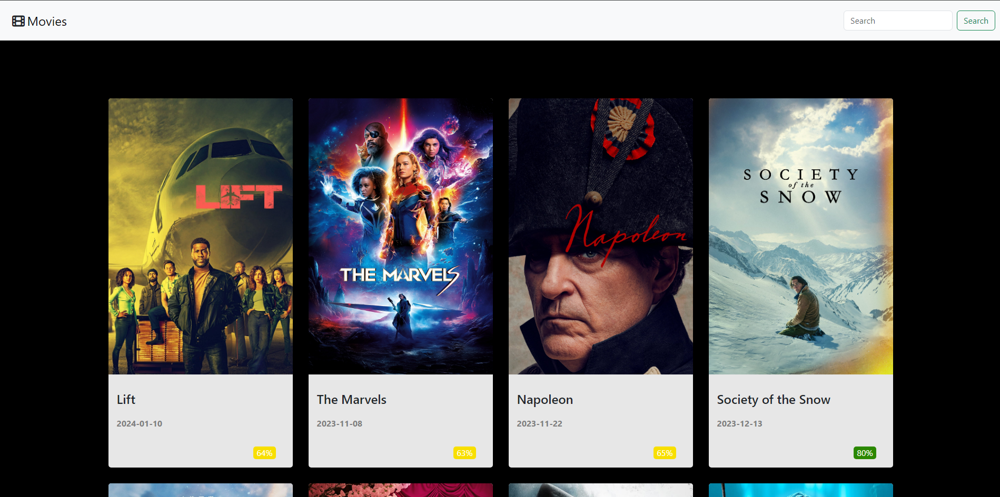

## Explorer de filmes

## Preview image

## Descrição
Projeto realizado com JavaScript, trabalhando com requisições vindas de uma API chamada The Movie DataBase<a href="https://developer.themoviedb.org/docs/getting-started"> (Ver documentação) </a>, assim que o site abre ele mostra os filmes mais recentes e suas caracteristicas, tais como Titulo, Data de lançamento, e Aceitação do público.

## Tecnologias e recursos
 - HTML
 - CSS
 - BOOTSTRAP
 - JAVASCRIPT
